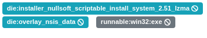
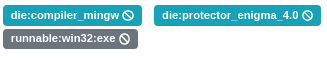

# Detect-It-Easy classifier for the Karton framework

A file type classifier based on Detect-It-East [DIE](https://github.com/horsicq/Detect-It-Easy). 

Module's only goal is to attach _DIE signatures_, as tags, to samples submitted to [mwdb-core](https://github.com/CERT-Polska/mwdb-core)

## Consumes

```json
{
    "type": "sample",
    "kind": "raw"
}, {
    "type": "sample",
    "stage": "recognized"
}
```

## Produces

```json
{
    "type": "sample",
    "stage": "analyzed"
}
```

## Event tags examples

<p align="center">
    
    
    
</p>

## Setup and configuration

### Dependencies

```bash
$ curl -s https://api.github.com/repos/horsicq/DIE-engine/releases/latest | grep browser_download_url | awk -F"\":" '{print $2}' | tr -d "\"" | grep deb | wget -q --show-progress -i -
# e.g. die_3.02-20210605_amd64.deb
$ sudo dpkg -i die_3.02-20210605_amd64.deb
```

### Modules install

```bash
$ git clone https://github.com/raw-data/karton-die-classifier/
$ cd karton-die-classifier/
$ python3 -m venv .venv
$ source .venv/bin/active
$ pip install .

$ karton-die-classifier
```